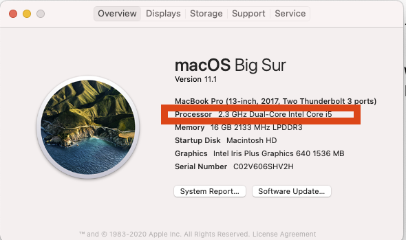

# Installfest - Getting Software Installed

In this, your first full lesson we'll get some software installed for you to use at Ada.

<!-- available callout types: info, success, warning, danger, secondary  -->
### !callout-danger

## A Tale of 2 Macs

This lesson has 2 main sections, one for Intel-based Macs and one for Apple Silicon Macs.  In late 2020, Apple released a new type of Macbook using an ARM-based chip designed in-house called the M1.  Prior to this Apple had used Intel x86 CPUs.  

Computers with M1 CPUs are great!  However... as they are new, not all developer tools have been written to work with the new chipset.  

So... we have some additional directions for working with them.  As the M1 landscape matures, we may have additional instructions for students using the new computers.  That's often the price for living on the cutting-edge.

### !end-callout

## Learning Goals

By the end of this lesson we should be able to...

- Install a variety of Mac software using [Homebrew](https://brew.sh/)

## Intel-based Macs

If you have an Intel-based Mac you can follow the [intel-based installfest](installfest/installfest-intel.resource.md).

## Apple Silicon Macs

If you have an M1-based Mac you need to first follow the [M1 installfest-setup](installfest/installfest-m1.resource.md) first before proceeding to the Intel-based installfest.

## Unclear?

If you are uncertain which kind of Mac you have you can go to **About This Mac**

Then look for the word Intel or M1 in the description.

