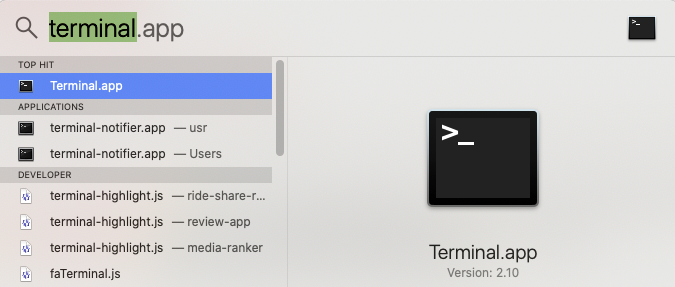

# Programming Workflow

## MacOS Screen Setup

<iframe src="https://adaacademy.hosted.panopto.com/Panopto/Pages/Embed.aspx?id=209606a9-85a4-4945-b34e-acb5001d2a0e&autoplay=false&offerviewer=true&showtitle=true&showbrand=false&start=0&interactivity=all" height="405" width="720" style="border: 1px solid #464646;" allowfullscreen allow="autoplay"></iframe>

It's very helpful to split your screen when writing code with one half of the screen consisting of your editor and the other the terminal or browser.  This way you can go back and forth between the editor and terminal with minimal disruption. 

There are a number of tools available to help you split your screen including:

* [MacOS Split Desktops](https://www.digitaltrends.com/computing/how-to-use-split-view-on-a-mac/)
* Install [Rectangle](https://rectangleapp.com/) - Free
* Install [Moom App](https://manytricks.com/moom/) - $10

## Terminal

<iframe src="https://adaacademy.hosted.panopto.com/Panopto/Pages/Embed.aspx?id=2cdaf784-ea88-4e27-872f-abd6002f4863&autoplay=false&offerviewer=true&showtitle=true&showbrand=false&start=0&interactivity=all" width=720 height=405 style="border: 1px solid #464646;" allowfullscreen allow="autoplay"></iframe>

As web developers we regularly use the terminal to run, edit, test and debug our applications.  As such it's important to get familiar with using the MacOS terminal. 

To launch terminal hit <kbd>cmd</kbd> + <kbd>spacebar</kbd> and then type terminal.  



You can also add the terminal application to your dock, by right-clicking on the application. 


There are a variety of keyboard combinations and commands you can use when using the terminal.

You can even write programs to automate the terminal and thus the operating system, which is called **shell programming**.  

### The Mac Keyboard

Macs have a number of special keys which are a little different from Windows.  You can read more about it on [keyshorts.com](https://keyshorts.com/blogs/blog/41999105-the-ultimate-guide-to-macbook-keyboard).  The control, alt/option and command keys are used for a variety of shortcuts in the terminal.


#### Terminal Shortcuts

| Command                             | Description                                                                                         |
| :---------------------------------- | :-------------------------------------------------------------------------------------------------- |
| <kbd>cmd</kbd> + <kbd>k</kbd>       | clear your screen                                                                                   |
| `touch <filename>`                  | creates a new file named filename                                                                   |
| `pwd`                               | <b>p</b>rints the <b>w</b>orking <b>d</b>irectory (displays the full path of the current directory) |
| `cd`                                | <b>c</b>change <b>d</b>irectory                                                                     |
| `cd ..`                             | go back a directory                                                                                 |
| `cd ~`                              | choose home directory                                                                               |
| `ls`                                | list the items in the directory                                                                     |
| `ls -a`                             | list the items in the directory, including hidden files                                             |
| `mkdir <dirname>`                   | make a new directory                                                                                |
| `rm <filename>`                     | removes the file named filename                                                                     |
| `rm -r <dirname>`                   | removes the directory named dirname (and everything in it)                                          |
| <kbd>&#8593;</kbd>                  | view the previous command                                                                           |
| <kbd>ctrl</kbd> + <kbd>a</kbd>      | go to beginning of line                                                                             |
| <kbd>ctrl</kbd> + <kbd>e</kbd>      | go to end of line                                                                                   |
| <kbd>alt</kbd> + <kbd>&#8594;</kbd> | move to the right, one word                                                                         |
| <kbd>alt</kbd> + <kbd>&#8592;</kbd> | move to the left, one word                                                                          |
| <kbd>ctrl</kbd> + <kbd>c</kbd>      | interrupt/stop a command                                                                            |

### The Python Repl

You can enter `python` in the terminal to enter a Read-Eval-Print-Loop environment.  This lets you enter individual lines of Python 3 code and see it immediately evaluated.

There are a few shortcut commands that are helpful to know.

#### irb commands

| Command                                  | Description                    |
| :--------------------------------------- | :----------------------------- |
| `irb`                                    | start interactive ruby session |
| `exit` or <kbd>ctrl</kbd> + <kbd>d</kbd> | exit an `irb` session          |
| <kbd>ctrl</kbd> + <kbd>c</kbd>           | interrupt/stop a command       |

### Running Python Files

You can run python files from the terminal by typing `python3` followed by the name of the file.  

For example if you have a file named, `example_file.py`, you could run the file from the terminal with the following.

```bash
$ python3 example_file.py
```


