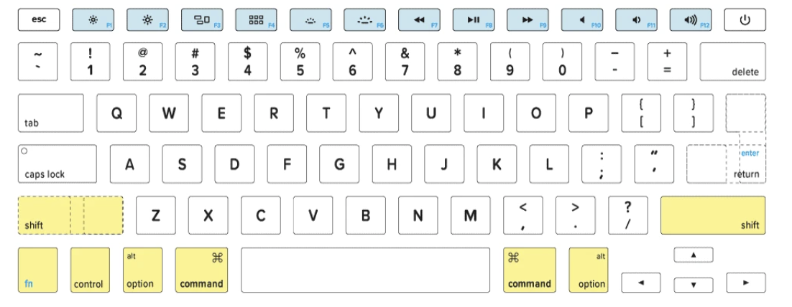

# Programming Workflow

## MacOS

An operating system provides the behind-the-scenes operations that allow humans to interact with computers. Some of these operations include:

- allocating system resources
- enforcing security and otherwise regulating how programs run
- providing common services and functionalities for software applications

The [operating system](https://en.wikipedia.org/wiki/Operating_system) we'll be using at Ada is **MacOS**, a Unix-based operating system owned and distributed by Apple Inc.

### !callout-info

## Updating Software

We'll find that our Macs will need to update the operating system periodically to keep up with security and new features. To check our machine's MacOS version, we can go to the top left corner of our screen and click  > About This Mac.

<br>

Generally, it's a good idea to update our Mac's software to the latest version by going to System Preferences > Software Update.

### !end-callout

## MacOS Screen Setup

<iframe src="https://adaacademy.hosted.panopto.com/Panopto/Pages/Embed.aspx?id=209606a9-85a4-4945-b34e-acb5001d2a0e&autoplay=false&offerviewer=true&showtitle=true&showbrand=false&start=0&interactivity=all" height="405" width="720" style="border: 1px solid #464646;" allowfullscreen allow="autoplay"></iframe>

It's very helpful to split our screen when writing code with one half of the screen consisting of our editor and the other the terminal or browser. This way we can go back and forth between the editor and terminal with minimal disruption.

There are a number of tools available to help us split our screen including:

- [MacOS Split Desktops](https://www.digitaltrends.com/computing/how-to-use-split-view-on-a-mac/)
- Install [Rectangle](https://rectangleapp.com/) - Free
- Install [Moom App](https://manytricks.com/moom/) - $10

## Customizing the Mouse

We do a lot of pointing and clicking as developers, so let's look at some settings that can make using the mouse (or trackpad) a little easier. These are accessed through the System Preferences, which can be found at the top-left of the system menu bar under  > System Preferences.

### Cursor Size

In the preferences search (top-right of the System Preferences window), enter `cursor size`. A matching entry will appear in the search results. Clicking it will take us to the Accessibility > Vision > Display > Pointer settings. Here we can adjust the size of the mouse cursor. Making it larger can be helpful when using a laptop screen, which can cause the cursor to appear _very_ small, or when sharing your desktop, which can make it easier for whomever you're working with to see where your cursor is.

<div style="text-align:center;">


</div>

### Double-click Speed

In the preferences search (top-right of the System Preferences window), enter `double click`. A result will appear labelled `Make mouse and trackpad easier`. Clicking it will take us to the Accessibility > Motor > Pointer Control > Mouse & Trackpad settings. Here we can adjust how quickly we need to click in order for MacOS to consider it to be a double-click, or even a triple-click. Double-click and triple-click are often used in editors to quickly select an entire word, or an entire line. But a fast double-click speed can put strain on the back of our hands if performed frequently. Turning down the double-click speed lets us use these mouse shortcuts while keeping our hands more relaxed.

<div style="text-align:center;">


</div>

## Terminal

<iframe src="https://adaacademy.hosted.panopto.com/Panopto/Pages/Embed.aspx?id=2cdaf784-ea88-4e27-872f-abd6002f4863&autoplay=false&offerviewer=true&showtitle=true&showbrand=false&start=0&interactivity=all" width=720 height=405 style="border: 1px solid #464646;" allowfullscreen allow="autoplay"></iframe>

As web developers we regularly use the terminal to run, edit, test and debug our applications. As such it's important to get familiar with using the MacOS terminal.

To launch terminal hit <kbd>cmd</kbd> + <kbd>Space</kbd> and then type terminal.


We can also add the terminal application to our dock, by right-clicking on the application.


There are a variety of keyboard combinations and commands we can use when using the terminal.

We can even write programs to automate the terminal and thus the operating system, which is called **shell programming**.

### The Mac Keyboard

Macs have a number of special keys which are a little different from Windows. You can read more about it on [keyshorts.com](https://keyshorts.com/blogs/blog/41999105-the-ultimate-guide-to-macbook-keyboard). The control, alt/option and command keys are used for a variety of shortcuts in the terminal.



#### Terminal Shortcuts

| <div style="width:200px;">Command</div> | Description                 |
| :-------------------------------------- | :-------------------------- |
| <kbd>cmd</kbd> + <kbd>k</kbd>           | clear your screen           |
| <kbd>&#8593;</kbd>                      | view the previous command   |
| <kbd>ctrl</kbd> + <kbd>a</kbd>          | go to beginning of line     |
| <kbd>ctrl</kbd> + <kbd>e</kbd>          | go to end of line           |
| <kbd>alt</kbd> + <kbd>&#8594;</kbd>     | move to the right, one word |
| <kbd>alt</kbd> + <kbd>&#8592;</kbd>     | move to the left, one word  |
| <kbd>ctrl</kbd> + <kbd>c</kbd>          | interrupt/stop a command    |

#### Useful Terminal Commands

Here are some useful commands we can use to start moving around in the terminal. Notice that the structure for terminal commands tends to resemble

```sh
<command> [-option] [-option]... [target]
```

`<command>` is a placeholder representing the name of the command, such as `pwd` or `ls`. The `<>` indicates this is a required part of the command.

`[-option]` is a placeholder representing a short option, a flag or setting that affects how the command runs, usually starting with a `-`. The `[]` indicates that this is an optional part of the command. For example `ls -a` is the command `ls` and has an option `-a`. The command is separated from the option by a space.

Finally, some commands need a target or argument, indicated by `[target]`. The target usually comes at the end of the command, and is separated from the command or options by a space.

Try to identify the commands, options, and targets while reading the examples below.

| <div style="width:200px;">Command</div> | Description                                                                                                                                                                                                                                                         |
| :-------------------------------------- | :------------------------------------------------------------------------------------------------------------------------------------------------------------------------------------------------------------------------------------------------------------------ |
| `touch <filename>`                      | creates a new file named filename                                                                                                                                                                                                                                   |
| `pwd`                                   | <b>p</b>rints the <b>w</b>orking <b>d</b>irectory (displays the full path of the current directory)                                                                                                                                                                 |
| `cd`                                    | <b>c</b>hange <b>d</b>irectory                                                                                                                                                                                                                                      |
| `cd ..`                                 | go back a directory                                                                                                                                                                                                                                                 |
| `cd ~`                                  | choose home directory                                                                                                                                                                                                                                               |
| `ls`                                    | list the items in the directory                                                                                                                                                                                                                                     |
| `ls -a`                                 | list the items in the directory, including hidden files                                                                                                                                                                                                             |
| `open <filename>`                       | Opens the specified filename using the program MacOS considers to be the default application for that kind of file. For instance, `open myfile.txt` would open the file `myfile.txt` in the default application for text (`.txt`) files, which is usually TextEdit. |
| `open .`                                | The terminal interprets `.` as "the current directory." So this says to open the current directory using the default application for directories, which is Finder. So `open .` will open a new Finder window showing the contents of the current directory.         |
| `mkdir <dirname>`                       | make a new directory                                                                                                                                                                                                                                                |
| `rm <filename>`                         | removes the file named filename                                                                                                                                                                                                                                     |
| `rm -r <dirname>`                       | removes the directory named dirname (and everything in it)                                                                                                                                                                                                          |

### MacOS Files

MacOS stores your files in a collection of nested directories. A directory can contain files, as well as other directories. Some directories are related to your user account, especially your home directory, and others are related to how the computer runs as a whole. As developers, we occasionally need to work with system files, and so learning about some of the standard file locations can be useful.

The top of the directory structure is called the **root**, and is written as a forward slash `/`. From the root, we can refer to any file or directory on the computer by writing its path. The **path** lists the names of all the nested directories we need to look in to find a certain file.

<br>

<details>

<summary>Expand for a visual representation of a directory structure.</summary>

```
/ (root)
├── Applications
├── Users
│   └── ada
│       ├── Documents
│       │   └── research-paper.doc
│      ...
├── bin
│   ├── cat
│   ├── cp
│   ├── echo
│   ├── pwd
│   ├── rm
│  ...
├── etc
├── tmp
├── usr
│   ├── local
│  ...  ├── bin
│      ...  ├── code
│           ├── git
│           ├── python3
│          ...
└── var
```

</details>

For instance, a file called `echo` which is located in a directory called `bin`, a directory found in the root, would be referenced with `/bin/echo`. We start the path with a forward slash representing the root directory, and separate each name in the path with the same forward slash character.

What if we had a different file called `research-paper.doc` stored in the `Documents` folder belonging to a user called `ada`? In MacOS, every user has their own home directory, which shares the same name as the user, and is stored in the `/Users` directory. So by the same process, starting from the root, and listing each directory name, the full path would be referenced with `/Users/ada/Documents/research-paper.doc`.

#### Absolute and Relative Paths

The paths we have looked at so far are **absolute paths**. They begin from the root directory. There is another kind of path, called a relative path. A **relative path** takes into account the current directory we are in (whatever directory we have most recently `cd`ed into). Unlike an absolute path, a relative path does _not_ start with a forward slash. Instead, we simply start the path with a directory located in our current folder.

If we were currently in the home directory of the `ada` user (`/Users/ada`), then to access the same `research-paper.doc` file as above using a relative path, we would write `Documents/research-paper.doc`. Notice that it does not start with a `/`, instead it starts with the name of the `Documents` folder directly.

#### Important Directories

There are a few directories that will be handy for us to know about. We don't need a lot of detail at the moment, but as we work more with MacOS computers, we may need to be aware of what some of these are used for.

| <div style="width:200px;">Directory Name</div> | Description                                                                                                                                                                                                                          |
| ---------------------------------------------- | ------------------------------------------------------------------------------------------------------------------------------------------------------------------------------------------------------------------------------------ |
| `/`                                            | The root directory. This is the top of the file system. All other directories and files can be reached from here.                                                                                                                    |
| `/Applications`                                | Primary location where MacOS UI-based programs (such as web browsers, VS Code, and Zoom) are installed.                                                                                                                              |
| `/Users/<user_name>`                           | The home directory for a user. A user named `ada` would have their home directory at the path `/Users/ada`. We can also refer to this directory with the shortcut character `~`.                                                     |
| `/bin`                                         | Holds so-called "essential" system programs (called binaries, hence bin) such as `echo` (prints a message), `cat` (prints a file), `cp` (copies a file or directory), and more!                                                      |
| `/etc`                                         | Holds system configuration files. Pronounced Et-see.                                                                                                                                                                                 |
| `/usr`                                         | Holds programs and data that any user can access, and which aren't needed during system startup. Pronounced the same as "user." Note this is different from the `/Users` directory, which is where user home directories are stored. |
| `/usr/local/bin`                               | Holds programs (binaries) that are not part of the core system. A lot of what we install using `brew` ends up here!                                                                                                                  |
| `/tmp`                                         | Hold temporary files typically created by currently running programs. Pronounced the same as "temp."                                                                                                                                 |
| `/var`                                         | Holds _variable length_ (hence var) files, which is a fancy way of saying log files. Long-running programs often log information somewhere in this directory, which we can use to troubleshoot if a program starts misbehaving!      |

### !callout-info

## Command Practice & Tips

In the terminal, let's make a new directory and change our current directory to this new one.

<br>

First, let's enter `cd` or `cd ~` to go to the home directory. To double check our current path, enter the command `pwd` which should display our home directory path `/Users/<your_username>`.

<br>

After confirming that we're in the home directory, let's create a new directory using `mkdir` followed by the directory name `first_folder`. The command should look like: `$ mkdir first_folder`

<br>

We can change our current directory using `cd` followed by the directory name. Rather than type the entire name of the directory, we can press the <kbd>tab</kbd> key to _autocomplete_ the name for us! For example, we can type `cd first` then press the <kbd>tab</kbd> key to see the terminal fill the rest of the directory name for us! Autocomplete is a handy feature that makes navigating the command line and code easier for developers.

<br>

And just like that, we've created the directory `first_folder`. When we enter `pwd` again, we should see its path as `/Users/<your_username>/first_folder`.

### !end-callout

### The Python Repl

We can enter `python` in the terminal to enter a Read-Eval-Print-Loop environment. This lets us enter individual lines of Python 3 code and see it immediately evaluated.

There are a few shortcut commands that are helpful to know.

#### Python Repl commands

| Command                                    | Description                      |
| :----------------------------------------- | :------------------------------- |
| `python` or `python3`                      | start interactive Python session |
| `exit()` or <kbd>ctrl</kbd> + <kbd>d</kbd> | exit Python session              |
| <kbd>ctrl</kbd> + <kbd>c</kbd>             | interrupt/stop a command         |

### Running Python Files

We can run python files from the terminal by typing `python3` followed by the name of the file.

For example if we have a file named, `example_file.py`, we could run the file from the terminal with the following.

```bash
$ python3 example_file.py
```

### Additional Resources

- [Getting to Know the Command Line](https://www.davidbaumgold.com/tutorials/command-line/)
