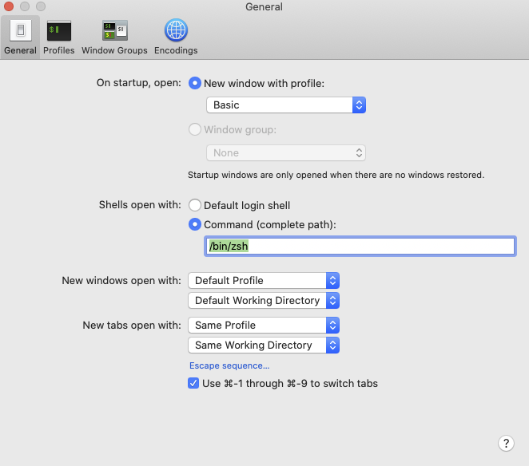
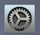

# Installfest for Intel Macs

## Overview

This time is dedicated to ensuring everyone has all of the tools, the right tools, and the right versions of tools to begin programming with the Ada curriculum.

Many of you will have some set of these tools installed, but we're going to go through them together and make sure everyone is set to go.

Follow the steps below, typing any necessary code into the Terminal application.

If you've got pieces installed, help your fellow students via Slack!

## Xcode Command-line Developer tools

Apple provides a set of UNIX-style development tools on the command-line.  To install it go to terminal and enter

```
xcode-select --install
```

You will then be prompted to allow it to install.


At this point, get some coffee... it may take a while... maybe homebrewed coffee!

## Homebrew

[Homebrew](https://brew.sh/) is a package manager for Mac.  Basically that means that Homebrew helps you install programs, update them and prevent conflicts between applications or tools.

Homebrew will require the xcode command line tools to be installed.

You can install homebrew by going to the terminal and entering:

```
/bin/bash -c "$(curl -fsSL https://raw.githubusercontent.com/Homebrew/install/HEAD/install.sh)"
```

### Verification

You can verify that it worked by entering

```
brew doctor
```

You should see, after a bit of processing, `Your system is ready to brew.`

## Python 3

Macs come with an older version of Python, usually 2.7.x.  However we will be using a version of Python 3 and we need to set up the Mac to use it.  Thus we can use homebrew to install it.

```
brew install python
```

We also need to tell Mac where to find python from now on (and not use that old 2.7 version).  The commands below tell the Bash and Zsh shells where to find Python

```
echo 'export PATH="/usr/local/opt/python/libexec/bin:$PATH"' >> ~/.zshrc
echo 'export PATH="/usr/local/opt/python/libexec/bin:$PATH"' >> ~/.profile
```

Then **Quit Terminal with Command-Q and restart the terminal**.

### PIP - Python's Package Installer Programm

We also use a program called **pip** to install additional python packages we can then use in our programs

### Verification

You can verify that it worked with the command `python --version` and see that it prints something like `Python 3.9.1`.

You should also verify that `pip` is working with `pip --version` and it should be in a python3 folder and say something like `pip 20.3.1 from /usr/local/lib/python3.9/site-packages/pip (python 3.9)`

### VS Code

# TODO Re-record this video

<iframe src="https://adaacademy.hosted.panopto.com/Panopto/Pages/Embed.aspx?id=9e5ed912-4961-49ed-b03a-abd60034e1b7&autoplay=false&offerviewer=true&showtitle=true&showbrand=false&start=0&interactivity=all" width=720 height=405 style="border: 1px solid #464646;" allowfullscreen allow="autoplay"></iframe>

We can install our code editor VS Code with the command:

```
brew cask install visual-studio-code
```

* [VS Code](https://code.visualstudio.com/) is a very extensible open-source editor which supports a variety of languages including Python, and JavaScript.  
* In VS Code, type <kbd>shift</kbd> + <kbd>cmd</kbd> + <kbd>p</kbd> and type **shell command to install the terminal shell command**.
  * This only needs to be done once to allow you to launch VS code from the terminal
* Now, to launch VS Code from terminal, type `code` followed by the file name or directory name
  * For example `code .` will open the present directory as a project folder.

#### VS Code Extensions

VS Code also comes with a number of extensions which you can install to provide new or different functionality.  Some of the recommended exentsions include:

*  [Live Share](https://marketplace.visualstudio.com/items?itemName=MS-vsliveshare.vsliveshare) - A way to collaborate on source code like Google Docs.
*  [Markdown All in One](https://marketplace.visualstudio.com/items?itemName=yzhang.markdown-all-in-one) - An extension to help writing markdown files
*  [Python](https://marketplace.visualstudio.com/items?itemName=ms-python.python) - The standard Python extension to provide syntax highlighting and intellisense.
*  [Indent Rainbow](https://marketplace.visualstudio.com/items?itemName=oderwat.indent-rainbow) - A nice extension to help you line up your indentations
*  [Bracket Pair Colorizer](https://marketplace.visualstudio.com/items?itemName=CoenraadS.bracket-pair-colorizer) - This extension colors matching brackets {} to match and make them easier to identify.
*  [Python Test Explorer](https://marketplace.visualstudio.com/items?itemName=LittleFoxTeam.vscode-python-test-adapter) - This extension lets you run tests individually in VS code via the Test Explorer UI
*  [ESLint](https://marketplace.visualstudio.com/items?itemName=dbaeumer.vscode-eslint) - A JavaScript extension for syntax highlighting

You are welcome to experiment with a variety of plugins for VS Code.

## Git

Git is an open source distributed version control system. We will talk about git in significant detail later. The short version is that we will use Git to version and share our code with others. We will spend a lot of time using Git in the Terminal, so it will become important that we configure the Terminal to have all of our Git preferences it and personalize it with our personal information.

### Install with Homebrew

Run the following command to install git onto your machine:

`$ brew install git`


### Configuring Git

We need to do some configuration so Git knows who we are, and so that it gives us colorful feedback. After Brew finishes the install, _read through these directions, **and then** input the commands listed below_:

Directions:
1. Figure out what your name is. We're going to ask you to input a command, and the example command says `"Your Actual Name"`. Instead of the literal text `"Your Actual Name"`, you need to input text that is... your actual name. You should keep the quotation marks.
1. Next, figure out what the email address associated with your GitHub account is. (Yes, you're going to need to remember how to log into your GitHub account). Similar to above, instead of the literal text `"The Email Associated with Your Github Account"`, please put in **the email address associated with your GitHub account.** You should keep the quotation marks.
1. Finally, input the following commands filling in your actual name and github email:

```bash
git config --global user.name "Your Actual Name"
git config --global user.email "The Email Associated with Your Github Account"
git config --global core.ignorecase false
git config --global color.diff auto
git config --global color.status auto
git config --global color.branch auto
git config --global push.default current
git config --global pull.rebase false
git config --global core.editor "code --wait"
```

### Trust but Verify

- `git config --get user.name` Should show your name
- `git config --get user.email` Should show the email address associated with your GitHub account


## Browsers

We will be using [Firefox](https://www.mozilla.org/en-US/firefox/) as our primary browser at Ada.  You can install it with:

```bash
$ brew cask install firefox
```

You may also want to use Google Chrome, which is also a fine browser.  You can install Google Chrome with Homebrew by typing:

```bash
$ brew cask install google-chrome
```

## It's All About Communication! Slack

Lastly we you should already have Ada's primary mode of communication installed... [**Slack!**](https://slack.com/downloads/osx). While it is **possible** to get by using the Slack website.  We recommend **strongly** to use the Desktop client.  You can install Slack with homebrew and the command:

```bash
$ brew cask install slack
```

When Ada has announcements or students want to share general information, we will generally use Slack.  If we have updates to projects or homework, we will use Slack.  We only use e-mail for personal communication and things we need to keep a record of (like absences).

That being said, please get familiar and comfortable with Slack, and make it your own space to build special-interest channels and discussion spaces.

It's also critically important to use emojis (not really, but it's fun!).  So once you have Slack running follow the directions [**here**](https://get.slack.help/hc/en-us/articles/206870177-Create-custom-emoji) to install a Slack Emoji of your choice.

You can find a great site for Slack Emoji's [**here**](https://slackmojis.com/).


## Customizing Your Shell - Optional

### Setting zsh as the default shell

A shell is a set of commands and user interface for controlling an operating system via the terminal.  With newly purchased Macs the default shell is zsh, while older macs use an older version of the Bash shell.

You can read more about [zsh vs bash](https://dev.to/jasmin/a-brief-difference-between-zsh-and-bash-5ebp) if you are interested.  

To set your shell to zsh first start terminal and then go to preferences.


Then set the **Shells open with:** to `/bin/zsh`.



### Oh My Zsh

Zsh is very customizable environent in zsh and there's a great community-driven framework for managing zsh configurations providing thousands of helper functions, plugins and themes.  Basically it lets you customize the look and feel of the terminal and add custom commands and shortcuts.  The most amazing thing is that **it comes with git integration!**

Using **Oh My Zsh** is completely optional at Ada, but it can be handy for it's support of git and extensibility.  You are welcome to install it if you are interested.

You can install it with:

```zsh
sh -c "$(curl -fsSL https://raw.github.com/robbyrussell/oh-my-zsh/master/tools/install.sh)"
```

You can read more about it on the [oh my zsh homepage](https://ohmyz.sh/).

## Note

If for any of these applications you get the following warning.


You can fix it by going to **System Preferences-->Security & Privacy** and selecting the button **Open Anyway**.




## In this lesson we installed:

1.  Xcode Command-line tools
1.  Python 3
1.  VS Code
1.  Firefox
1.  Git
1.  Slack

These tools will be important as we begin to write programs at Ada.  