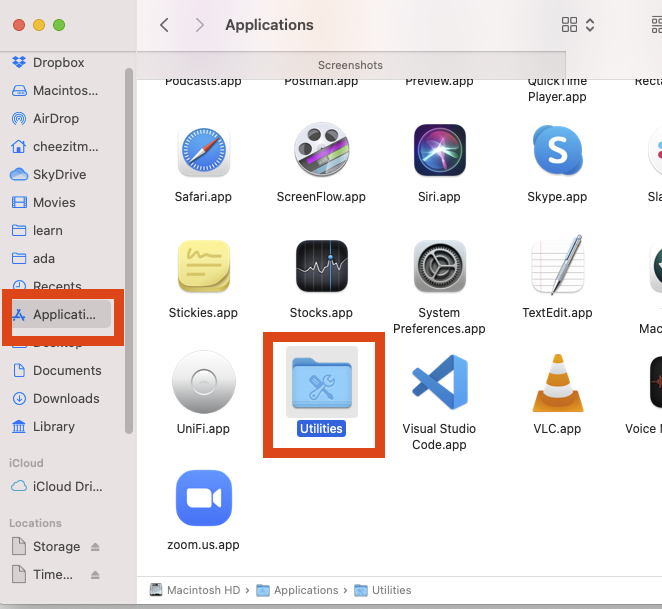
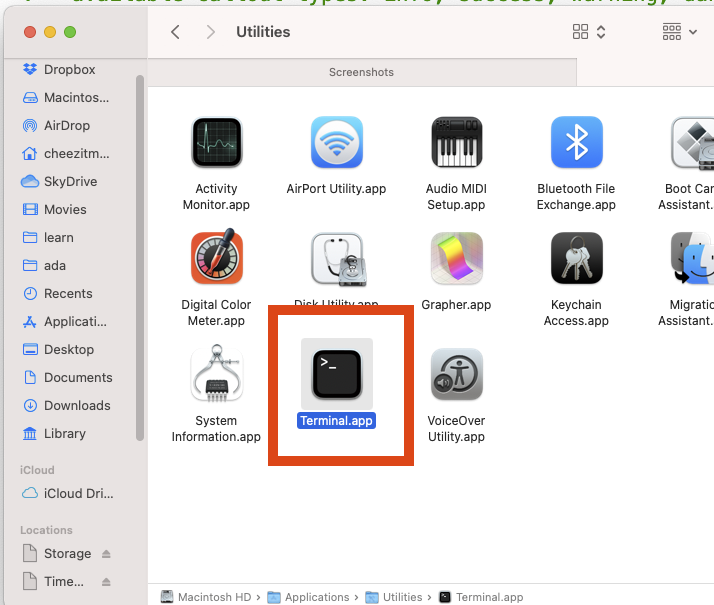
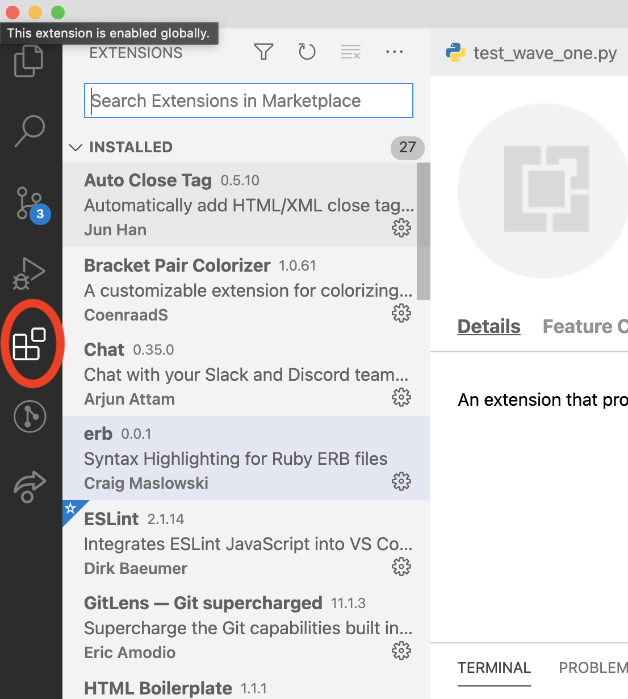
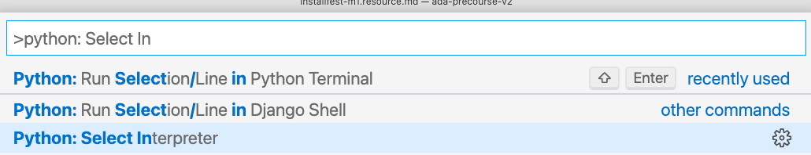
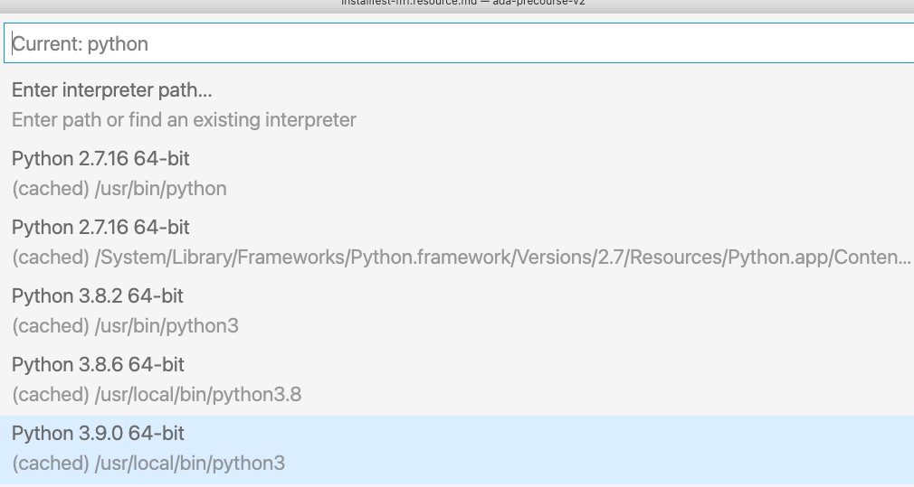

# Getting an M1 Macbook Ready for Ada

<iframe src="https://adaacademy.hosted.panopto.com/Panopto/Pages/Embed.aspx?id=3766a0f2-c498-4b51-a7d0-ac9e01835af7&autoplay=false&offerviewer=true&showtitle=true&showbrand=false&start=0&interactivity=all" height="405" width="720" style="border: 1px solid #464646;" allowfullscreen allow="autoplay"></iframe>

Currently many of the packages we use at Ada through the package manager Homebrew are not fully supported to run on M1 Macs, also known as Apple Silicon.  We're going to install homebrew natively, i.e. compile the source code to run directly on the M1 chip, use it to install Python 3, and then manually install some Apple Silicon-supported apps.

<!-- available callout types: info, success, warning, danger, secondary  -->
### !callout-info

## Homebrew Not Fully Supported

Be aware that Homebrew isn't fully supported on Apple Silicon.  You may run into some complications with Python and other pieces of software.  That's ok, but it will be things that you need to work through.  As time goes on, Homebrew will be more and more supported on Apple Silicon and things will get easier.

This is life with the latest technology!

### !end-callout


## Installing Homebrew & Python 3

To install Homebrew natively first open terminal by going to Finder and selecting Applications-->Utilities-->Terminal





Then run the command:

```
xcode-select --install
```

This will install Xcode's command line tools.  You will get a pop-up to install the from software update, accept and get ready to wait a bit.  Go get a coffee, this will take a while.

When it finishes you can install homebrew, Git, and python3 with:

```
/bin/bash -c "$(curl -fsSL https://gist.githubusercontent.com/CheezItMan/2c883fc0c43ab44a5554d663995fe92e/raw/12cafa8e8d26c34d3d272c9da9c4402897dd4cca/install_python_apple_m1.bash)"
```

You will be prompted for your password.

This will run a script created by Ada to install Homebrew and use it to install Python 3 and git.  **It will stop and prompt you for your name and email to configure git, please enter them**.  

### Verify

You can verify that Homebrew install properly with:

```
brew doctor
```

You should get something like:  `Your system is ready to brew.`

Then you can verify that python is installed with:

```
python --version
pip --version
git --version
```

You should get a Python version which is a variant of 3.9 for python and 20 for pip and it should print a version of git.
## Web Browsers

You can just use the Intel installfest to install Chrome & Slack, or manually install them (not using Homebrew).


- [Install Firefox](https://www.mozilla.org/en-US/firefox/new/)
- [Install Chrome](https://www.google.com/chrome/) (Optional)

## VS Code

We will be using the [Visual Studio Code Editor](https://code.visualstudio.com/).  Go to the link provided and install the application.

* In VS Code, type <kbd>shift</kbd> + <kbd>cmd</kbd> + <kbd>p</kbd> and type **shell command to install the terminal shell command**.
  * This only needs to be done once to allow you to launch VS code from the terminal
* Now, to launch VS Code from terminal, type `code` followed by the file name or directory name
  * For example `code .` will open the present directory as a project folder.

VS Code also comes with a number of extensions which you can install to provide new or different functionality. 

Extensions can be searched for and installed from the "Extensions" menu on the sidebar of VS Code. 



Some of the recommended extensions include:

*  [Live Share](https://marketplace.visualstudio.com/items?itemName=MS-vsliveshare.vsliveshare) - A way to collaborate on source code like Google Docs.
*  [Markdown All in One](https://marketplace.visualstudio.com/items?itemName=yzhang.markdown-all-in-one) - An extension to help writing markdown files
*  [Python](https://marketplace.visualstudio.com/items?itemName=ms-python.python) - The standard Python extension to provide syntax highlighting and code suggestions.
*  [Indent Rainbow](https://marketplace.visualstudio.com/items?itemName=oderwat.indent-rainbow) - A nice extension to help you line up your indentations.
*  [Bracket Pair Colorizer](https://marketplace.visualstudio.com/items?itemName=CoenraadS.bracket-pair-colorizer) - This extension colors matching brackets {} to match and make them easier to identify.
*  [Python Test Explorer](https://marketplace.visualstudio.com/items?itemName=LittleFoxTeam.vscode-python-test-adapter) - This extension lets you run tests individually in VS code via the Test Explorer UI.
*  [ESLint](https://marketplace.visualstudio.com/items?itemName=dbaeumer.vscode-eslint) - A style checker for JavaScript code.

You are welcome to experiment with a variety of plugins for VS Code.

### Selecting Python Version for VS Code

Once you have the Python extension installed start up VS Code.

Then open the command-palette with `Shift-Command-P` and enter `Python: select interpreter`





## It's All About Communication! Slack

Lastly we you should already have Ada's primary mode of communication installed... [**Slack!**](https://slack.com/downloads/osx). While it is **possible** to get by using the Slack website.  We recommend **strongly** to use the Desktop client.  You can install Slack by downloading it from the [Install Slack website](https://slack.com/downloads/mac).

When Ada has announcements or students want to share general information, we will generally use Slack.  If we have updates to projects or homework, we will use Slack.  We only use e-mail for personal communication and things we need to keep a record of (like absences).

That being said, please get familiar and comfortable with Slack, and make it your own space to build special-interest channels and discussion spaces.

It's also critically important to use emojis (not really, but it's fun!).  So once you have Slack running follow the directions [**here**](https://get.slack.help/hc/en-us/articles/206870177-Create-custom-emoji) to install a Slack Emoji of your choice.

You can find a great site for Slack Emoji [**here**](https://slackmojis.com/).

### Optional - Oh My Zsh

Zsh is very customizable environent in zsh and there's a great community-driven framework for managing zsh configurations providing thousands of helper functions, plugins and themes.  Basically it lets you customize the look and feel of the terminal and add custom commands and shortcuts.  The most amazing thing is that **it comes with git integration!**

Using **Oh My Zsh** is completely optional at Ada, but it can be handy for it's support of git and extensibility.  You are welcome to install it if you are interested.

You can install it with:

```zsh
sh -c "$(curl -fsSL https://raw.github.com/robbyrussell/oh-my-zsh/master/tools/install.sh)"
```

You can read more about it on the [oh my zsh homepage](https://ohmyz.sh/).

## Resources

- [This guide is taken from OSX Daily](https://osxdaily.com/2020/11/18/how-run-homebrew-x86-terminal-apple-silicon-mac/)
- [Homebrew's Current status on Apple Silicon](https://github.com/Homebrew/brew/issues/10152)
