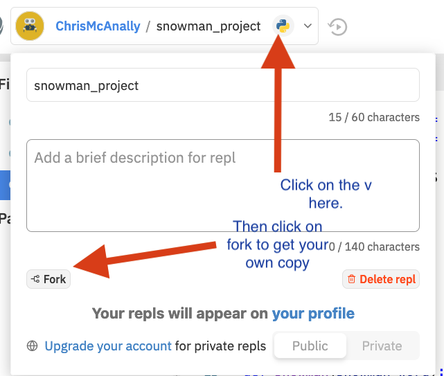
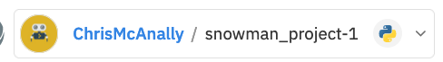

# Snowman Project

<!-- >>>>>>>>>>>>>>>>>>>>>> BEGIN CHALLENGE >>>>>>>>>>>>>>>>>>>>>> -->
<!-- Replace everything in square brackets [] and remove brackets  -->

### !challenge

* type: short-answer
* id: e035450e-a9c7-48b7-b3e1-44e74b0eac08
* title: The Final Snowman
* points: 4
* topics: python, dictionaries, functions, lists

##### !question

Go to the [Snowman Game Repl](https://repl.it/@ChrisMcAnally/snowmanproject#game.py) and fork the project.  



You can also give the repl a new name here.



You will need to complete the `snowman(snowman_word)` function using the other functions that we built in previous exercises.  

When you run the program it will give you the opportunity to run it against some automated tests, which check to see if, after several guesses you print out, "Congratuations, you win!" for success and "Sorry, you lose!  The word was {snowman_word}" for failure.

Alternatively you can select to play the game (by entering "p") and see how it works.

You should make use of the following functions from the previous lessons:

- `print_snowman_graphic(num_wrong_guesses)` - This function prints out the appropriate snowman image depending on the number of wrong guesses the player has made.
- `build_word_list(word)` - This function builds a list of dictionaries with each dictionary holding a letter from the word and if that letter has been guessed yet or not.
- `print_word_list(word_list)` - This function prints out either letters from the word or underscores depending on if those letters have been guessed or not.
- `get_letter_from_user(wrong_list, correct_guesses_list)` - This function gets a letter guess from the user and doesn't accept a previously guessed letter or a non alphabetic character.
- `update_and_check_word_list(list_of_letters, guessed_letter)` - This function updates the list of guessed letters and returns `True` if all the letters in the word are guessed.


When you finish place a link to your repl here.

##### !end-question

##### !placeholder

When you finish place a link to your repl here.

##### !end-placeholder

##### !answer


##### !end-answer

<!-- other optional sections -->
<!-- !hint - !end-hint (markdown, hidden, students click to view) -->
<!-- !rubric - !end-rubric (markdown, instructors can see while scoring a checkpoint) -->
##### !explanation

Our solution was the following:

```python
def snowman(snowman_word):
    """Complete the snowman function
    replace "pass" below with your own code
    """
    snowman_list = build_word_list(snowman_word)
    correct_guesses_list = []
    wrong_guesses_list = []
    all_guessed = False
    print_word_list(snowman_list)

    while (len(wrong_guesses_list) < SNOWMAN_MAX_WRONG_GUESSES and not all_guessed):
        user_input = get_letter_from_user(correct_guesses_list, wrong_guesses_list)
        if user_input in snowman_word:
            print("You guessed a letter that' in the word!")
            correct_guesses_list.append(user_input)
            all_guessed = update_and_check_word_list(snowman_list, user_input)
        else:
            print(f"The letter {user_input} is not in the word")
            wrong_guesses_list.append(user_input)
        
        print_snowman_graphic(len(wrong_guesses_list))
        print_word_list(snowman_list)
        print("Wrong guesses: " + " ".join(wrong_guesses_list))
    
    if all_guessed:
        print("Congratuations, you win!")
    else:
        print(f"Sorry, you lose!  The word was {snowman_word}")
```

##### !end-explanation

### !end-challenge

<!-- ======================= END CHALLENGE ======================= -->