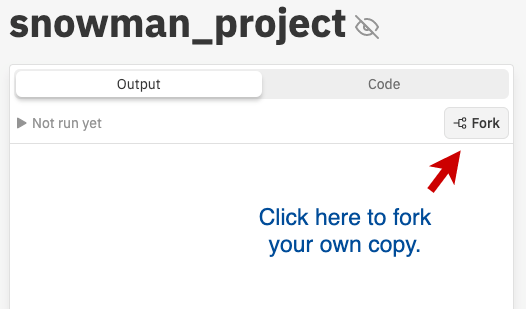

# Snowman Project

<iframe src="https://adaacademy.hosted.panopto.com/Panopto/Pages/Embed.aspx?id=ef2226d4-a198-4d39-9ab3-acb10166743d&autoplay=false&offerviewer=true&showtitle=true&showbrand=false&start=0&interactivity=all" height="405" width="720" style="border: 1px solid #464646;" allowfullscreen allow="autoplay"></iframe>

### !callout-warning

### !end-callout


<!-- >>>>>>>>>>>>>>>>>>>>>> BEGIN CHALLENGE >>>>>>>>>>>>>>>>>>>>>> -->
<!-- Replace everything in square brackets [] and remove brackets  -->

### !challenge

* type: short-answer
* id: e035450e-a9c7-48b7-b3e1-44e74b0eac08
* title: The Final Snowman
* points: 4
* topics: python, dictionaries, functions, lists

##### !question

Go to the [Snowman Game Repl](https://replit.com/@adacore/snowmanproject) and fork the project.  



You can also give the repl a new name here.


**After this refresh the browser to avoid a small bug with Repl and imported packages.**

You will need to complete the `snowman(snowman_word)` function using the other functions that we built in previous exercises.  

When you run the program it will give you the opportunity to run it against some automated tests, which check to see if, after several guesses you print out, "Congratuations, you win!" for success and "Sorry, you lose! The word was {snowman_word}" for failure.

Alternatively you can select to play the game (by entering "p") and see how it works.

## Please Note

The `repl` you've cloned has several files:

1. `main.py` that will run the game. No need to modify this file.
1. `game.py` that holds the important `snowman(snowman_words)` function we *will* modify
1. `game_test.py` that holds a few written test that will allow us to test your code. No need to modify this file, but feel free to take a look at what these tests might expect.

Several functions have already been made for you to *use* as shown below. You do not need to create them again.

When adding your code, you only need to modify the `snowman(snowman_word)` function.  Note that this function takes a parameter `snowman_word`.  For testing purposes, we will be passing in the random word rather than using RandomWord.

---

You should make use of the following functions from the previous lessons (already created for you):

- `print_snowman_graphic(num_wrong_guesses)` - This function prints out the appropriate snowman image depending on the number of wrong guesses the player has made.
- `build_word_dict(snowman_word)` - This function takes snowman_word as input and returns a dictionary with a key-value pair for each letter in snowman_word where the key is the letter and the value is `False`.
- `get_letter_from_user(snowman_word_dict, wrong_guesses_list)` - This function takes the snowman_word_dict and the list of characters that have been guessed incorrectly (wrong_guesses_list) as input. It asks for input from the user of a single character until a valid character is provided and then returns this character.
- `get_word_progress(snowman_word, snowman_word_dict)` - This function takes the snowman_word and snowman_word_dict as input. It prints an output_string that shows the correct letter guess placements as well as the placements for the letters yet to be guessed. It returns True if all the letters of the word have been guessed, and False otherwise.


When you finish place a link to your repl here.

##### !end-question

##### !placeholder

When you finish place a link to your repl here.

##### !end-placeholder

##### !answer

/^https\:\/\/replit\.com/

##### !end-answer

##### !explanation

Our solution was the following:

```python

def snowman(snowman_word):
    """Complete the snowman function
    replace "pass" below with your own code
    """
    snowman_dict = build_word_dict(snowman_word)
    wrong_guesses = []
    all_guessed = False
    get_word_progress(snowman_word, snowman_dict)

    while len(wrong_guesses_list) < SNOWMAN_WRONG_GUESSES and not all_guessed:
        user_input = get_letter_from_user(snowman_dict, wrong_guesses_list)
        if user_input in snowman_word:
            print("You guessed a letter that's in the word!")
            snowman_dict[user_input] = True
        else:
            print(f"The letter {user_input} is not in the word")
            wrong_guesses_list.append(user_input)
        all_guessed = get_word_progress(snowman_word, snowman_dict)
        print_snowman(len(wrong_guesses_list))
        print("Wrong guesses: " + " ".join(wrong_guesses_list))

    if all_guessed:
        print("Congratulations, you win!")
    else:
        print(f"Sorry, you lose!  The word was {snowman_word}")
```

##### !end-explanation

### !end-challenge

<!-- ======================= END CHALLENGE ======================= -->
