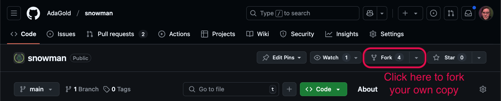

# Snowman Project

<!-- <iframe src="https://adaacademy.hosted.panopto.com/Panopto/Pages/Embed.aspx?id=6bb27215-9ce6-4b0d-b054-ae1b01594d08&autoplay=false&offerviewer=true&showtitle=true&showbrand=false&captions=true&interactivity=all" height="405" width="720" style="border: 1px solid #464646;" allowfullscreen allow="autoplay"></iframe> -->


<!-- >>>>>>>>>>>>>>>>>>>>>> BEGIN CHALLENGE >>>>>>>>>>>>>>>>>>>>>> -->
<!-- Replace everything in square brackets [] and remove brackets  -->

### !challenge

* type: short-answer
* id: e035450e-a9c7-48b7-b3e1-44e74b0eac08
* title: The Final Snowman
* points: 3
* topics: python, dictionaries, functions, lists, loops

##### !question

Go to the [Snowman Game Repo](https://github.com/AdaGold/snowman) and fork the project.  


*Fig. Select the "Fork" button to fork your own version of the project.* [*(Full size image)*](images/fork_snowman.png)

You can give the repo a new name here.


*Fig. You can rename your forked version of the project* [*(Full size image)*](images/new-name.png)

You will need to complete the `snowman(snowman_word)` function using the other functions that we built in previous exercises.  

Instructions to set up and run the code are in the README.md file of the repo. When you run the program it will give you the opportunity to:
- play the game by entering "p" to see how it works 
- run the code against some automated tests by entering "t". 
The tests check to see if, after several guesses your function prints out, `Congratulations, you win!` for success and `Sorry, you lose! The word was {snowman_word}` for failure.

## Please Note

The repository you've cloned has several files:

- `main.py` that will run the game. You should not modify this file.
- `game.py` that holds the important `snowman(snowman_words)` function that you *will* modify
- `game_test.py` that holds a few written test that will allow us to test your code. You should not modify this file, but feel free to take a look at what these tests expect.

When adding your code, **you only need to modify the `snowman(snowman_word)` function**.  
* Note that the `snowman` function takes a parameter `snowman_word`.  For testing purposes, we will be passing in the random word as an argument rather than using `RandomWord` inside the `snowman` function.

---

Several functions that we worked on during the lessons have already been added to `game.py` for you to use. These functions are listed below, you do not need to create them again.

- `print_snowman_graphic(wrong_guesses_count)` - This function prints out the appropriate snowman image depending on the number of wrong guesses the player has made.
- `build_letter_status_dict(snowman_word)` - This function takes `snowman_word` as input and returns a dictionary with a key-value pair for each letter in `snowman_word`, where the key is the letter and the value is `False`.
- `get_letter_from_user(correct_letter_guess_statuses, wrong_guesses_list)` - This function takes the `correct_letter_guess_statuses` and the list of characters that have been guessed incorrectly (`wrong_guesses_list`) as input. It repeatedly asks the user to enter a single character until a valid character is provided. Once a valid character is entered, it is returned.
- `print_word_progress_string(snowman_word, correct_letter_guess_statuses)` - This function takes the `snowman_word` and `correct_letter_guess_statuses` as input. It calls `generate_word_progress_string` and prints the output. 
- `generate_word_progress_string(snowman_word, correct_letter_guess_statuses)` - This function takes the `snowman_word` and `correct_letter_guess_statuses` as input. It creates and returns a string that shows the correct letter guess placements as well as the placements for the letters yet to be guessed. 
- `is_word_guessed(snowman_word, correct_letter_guess_statuses)` - This function takes the `snowman_word` and `correct_letter_guess_statuses` as input. It returns `True` if all the letters of the word have been guessed, and `False` otherwise.

---

When you finish, copy the URL of your repo and submit the link below for review.


*Fig. Select the "Invite" button to generate a join link.* [*(Full size image)*](images/repl_invite.png)


*Fig. Enable the "Private join link" toggle so a link is generated and copy the link.* [*(Full size image)*](images/repl_join_link.png)

##### !end-question

##### !placeholder

Submit your repo's link here for review.

##### !end-placeholder

##### !answer

/^https\:\/\/github\.com/

##### !end-answer

##### !explanation

Our solution was the following:

```python

def snowman(snowman_word):
    """Complete the snowman function
    replace "pass" below with your own code
    """
    correct_letter_guess_statuses = build_letter_status_dict(snowman_word)
    wrong_guesses_list = []
    all_guessed = False
    is_word_guessed(snowman_word, correct_letter_guess_statuses)

    while len(wrong_guesses_list) < SNOWMAN_WRONG_GUESSES and not all_guessed:
        user_input = get_letter_from_user(correct_letter_guess_statuses, wrong_guesses_list)
        if user_input in snowman_word:
            print("You guessed a letter that's in the word!")
            correct_letter_guess_statuses[user_input] = True
        else:
            print(f"The letter {user_input} is not in the word")
            wrong_guesses_list.append(user_input)
        all_guessed = is_word_guessed(snowman_word, correct_letter_guess_statuses)
        print_snowman_graphic(len(wrong_guesses_list))
        print("Wrong guesses: " + " ".join(wrong_guesses_list))

    if all_guessed:
        print("Congratulations, you win!")
    else:
        print(f"Sorry, you lose!  The word was {snowman_word}")
```

##### !end-explanation

### !end-challenge

<!-- ======================= END CHALLENGE ======================= -->
