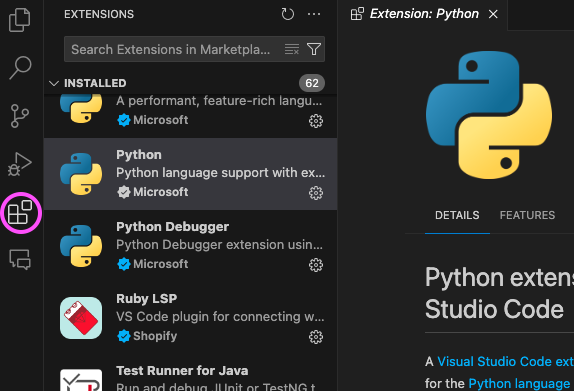
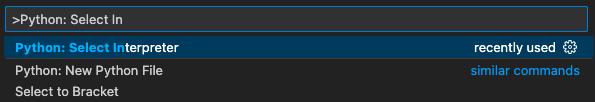
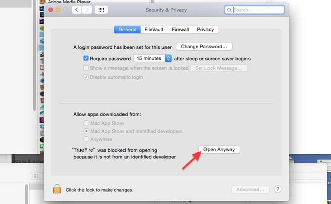

# Installfest - Getting Software Installed

## Overview

In this, our first full lesson, we'll get some software installed that we'll need at Ada.

It's important to ensure that everyone has all the right tools, with compatible versions, so we can successfully begin programming along with the Ada curriculum.

Many students will have some set of these tools installed already, but be sure to read through all of these instructions to make sure they are compatible. If any of these instructions are unclear, try asking for help in Slack (after it's been installed).

Note that many of these tools are under regular development, and may have newer versions than are listed here. Generally, any version the same or newer than what is mentioned in the instructions will be fine, but be sure to ask in Slack if there is any uncertainty about the correct versions of the required software.

Follow the steps below, typing any necessary commands into the Terminal application, which can be found in Finder under Applications > Utilities > Terminal.

After finishing, keep an eye on Slack for anyone else asking for help, and share your experiences!

<!-- available callout types: info, success, warning, danger, secondary  -->

### !callout-info

## A Tale of 2 Macs

In late 2020, Apple released a new type of Macbook using an in-house designed ARM-based chip called the M1. Prior to this Apple had used Intel x86 CPUs. It's useful to know that different physical architectures of Macbooks exist, since on occasion it can mean different troubleshooting steps when there are installation issues.

### !end-callout

## Learning Goals

By the end of this lesson we should be able to...

- Install a variety of Mac software using [Homebrew](https://brew.sh/)

## Installfest Instructions

<iframe src="https://adaacademy.hosted.panopto.com/Panopto/Pages/Embed.aspx?id=74b0dc57-aec2-497a-a14b-ac9f0020d987&autoplay=false&offerviewer=true&showtitle=true&showbrand=false&start=0&interactivity=all" height="405" width="720" style="border: 1px solid #464646;" allowfullscreen allow="autoplay"></iframe>

## Xcode Command-line Developer tools

Apple provides a set of UNIX-style development tools on the command-line. To install it go to terminal and enter

```
$ xcode-select --install
```

### !callout-info

## `$` Indicates the Terminal Prompt

When following instructions that involve typing terminal commands, the prompt is often indicated with a character like `$` or `%`. These characters should _not_ be typed in.

<br>

There are a variety of programs that we'll encounter as developers. Many are run through the terminal, and some present their own prompts. By labelling the commands with a representative prompt, instructions can make it more clear where the command should be entered.

<br>

For now, we should focus on getting used to seeing the prompt character, and being careful not to type it in or copy-pasting it. If we accidentally include the prompt character in the commands we input, an error such as `zsh: command not found: $` will be displayed.

### !end-callout

You will then be prompted to allow it to install.


At this point, get some coffee... it may take a while... maybe homebrewed coffee!

### !callout-info

## Xcode Command Line Tools Depend on the OS Version

Apple releases MacOS updates relatively frequently. It is often necessary to update the Xcode command line tools after an OS update. If `brew` suddenly starts failing after a recent OS update, try running the `$ xcode-select --install` command again to see if that resolves the issue.

### !end-callout

## Install Homebrew, Python 3, Node & Optionals

The following script will install some tools we will use including:

- Homebrew
- Python 3
- Pip 3
- Git
- Node
- VS Code

It will also give some options to automatically install:

- Firefox
- Google Chrome
- Slack for Mac

### !callout-danger

## Remove Previous Installations Before Running the Installfest Script

Adies are curious and have often installed some of these tools already. If this describes you, please remove any previous installations of Homebrew, Python, Node, Git, or VS Code before running the Installfest script. This will help avoid conflicts and ensure that the correct versions are installed so that everyone is using the same tools.

<br />

If you are unsure how to remove these tools, please reach out for help in Slack!

<br />

If you already have any of the optional tools installed, you do not need to uninstall them. Just respond `N` when prompted to install them. If you do *not* have them installed, you should install at least one of the web browsers (Firefox or Chrome), and Slack. The curriculum will assume you have access to one of these browsers, and Slack is required for communication. There should be no issue with using installations of the optional tools that you performed on your own.

### !end-callout

Copy the line below in its entirety (avoiding the `$`), paste it into the terminal and hit enter. You will be prompted for your password. Don't be alarmed if you don't see anything appear as you type. It's still getting entered.

```bash
$ /bin/zsh -c "$(curl -fsSL https://gist.githubusercontent.com/ada-instructors/21027e509214e96551b1a20943e9731c/raw/69f1ce6a6af12725cd9be90227caa8dc3d8f75f2/ada_installfest.zsh)"
```

**When the install finishes, quit and restart your terminal.** Without doing this, the installation above may not take affect.

### !callout-danger

## Check for Errors After Running the Installfest Script

Be sure to read any messages that appear in the terminal after running the script. If there are any errors, please reach out for help in Slack.

### !end-callout

### About Homebrew

[Homebrew](https://brew.sh/) is a package manager for Mac. Basically that means that Homebrew helps us install programs, update them, and prevent conflicts between applications or tools.

#### Verification

We can verify that homebrew is working properly by entering the following command in the terminal

```
$ brew doctor
```

We should see, after a bit of processing, `Your system is ready to brew.`

### About Python 3

Macs come with an older version of Python 3, which is primarily intended for use by the Mac system software itself. To develop our own Python programs, we set up a newer version of Python that we can update and modify without affecting the system-installed version. The long command we entered previously used Homebrew to install it.

#### PIP - Python's Package Installer Program

We also use a program called **pip** to install additional python packages which we can then use in our programs. Pip was installed along with Python 3 during the previous command.

#### Verification

We can verify that the Python installation worked by running the command `$ python --version` and see that it prints something like `Python 3.12.2`. A newer (larger-numbered) version is also fine, and only means that time has elapsed since these instructions were last updated.

If you see an older (smaller-numbered, such as a version starting with `3.11` or lower) it is not using the correct version. Perhaps the step above about restarting the terminal was skipped. Try quitting the terminal and reopening it to see if that fixes it... If not, reach out to a classmate or instructor!

We should also verify that `pip` is working with `$ pip --version`. It should be in a python3 folder and display a message like `pip 24.0 from /usr/local/lib/python3.12/site-packages/pip (python 3.12)`. Again, a newer version is fine, but an older version (such as `23.0` or lower) is a sign that something went wrong.

### VS Code

- [VS Code](https://code.visualstudio.com/) is a very extensible open-source editor which supports a variety of languages including Python, and JavaScript.
- To launch VS Code from the terminal, type `code` followed by the file name or directory name
  - For example `$ code .` will open the present directory as a project folder.

#### VS Code Extensions

VS Code also supports a number of extensions which can be installed to provide new or different functionality.

Extensions can be searched for and installed from the "Extensions" menu on the sidebar of VS Code.

  
*Fig. The Extensions button (circled) in the sidebar of VS Code*

##### Required Extensions

This extension is _required_ for doing Python development in VS Code.

- [Python](https://marketplace.visualstudio.com/items?itemName=ms-python.python) - The standard Python extension to provide syntax highlighting and code suggestions.

After installing the Python extension:

- Open the command-palette with <kbd>shift</kbd> + <kbd>cmd</kbd> + <kbd>p</kbd> and enter `Python: select interpreter`
- Select the Python interpreter that was reported when we checked the version earlier.

  
*Fig. Locate the option to select the Python interpreter*

  
*Fig. Pick the Python version that matches the version reported earlier.*

##### Recommended Extensions

Some recommended extensions include:

- [Live Share](https://marketplace.visualstudio.com/items?itemName=MS-vsliveshare.vsliveshare) - A way to collaborate on source code like Google Docs.
- [Markdown All in One](https://marketplace.visualstudio.com/items?itemName=yzhang.markdown-all-in-one) - An extension to help writing markdown files
- [Indent Rainbow](https://marketplace.visualstudio.com/items?itemName=oderwat.indent-rainbow) - A nice extension to help you line up your indentations.
- [ESLint](https://marketplace.visualstudio.com/items?itemName=dbaeumer.vscode-eslint) - A style checker for JavaScript code.
- [Git History](https://marketplace.visualstudio.com/items?itemName=donjayamanne.githistory) - Adds useful commands to VS Code for exploring and managing the history of Git repositories.

### !callout-warning

## Differences from Lesson Video

The video accompanying this lesson suggests installing the Python Test Explorer extension. This was potentially helpful with some older versions of the VS Code Python extension, but shouldn't be needed anymore. Installing the Python Test Explorer can also result in multiple copies of tests being displayed, which can be confusing.

<br>

Without a specific need, we should now avoid installing the Python Test Explorer extension.

### !end-callout

There are _many_ extensions available for VS Code. Experiment with them and see what what works best for you!

### About Git

Git is an open source distributed version control system. We will talk about Git in significant detail later. The short version is that we will use Git to version and share our code with others. We will spend a lot of time using Git in the Terminal, so it will become important that we configure the Terminal to have all of our Git preferences, and personalize it with our personal information.

#### Trust but Verify

We can confirm whether Git is installed properly by entering the following commands at the terminal.

- `$ git config --get user.name` Should show your name. This was prompted by the Installfest script.
- `$ git config --get user.email` Should show the email address associated with your GitHub account. This was also prompted by the Installfest script.
- `$ git config --global core.editor "code --wait"`
  - This will set VS Code to be the default editor for Git commit messages (more on that in the course).
  - This should have been set by the Installfest script as well, but it doesn't hurt to run it again here.

## Browsers

We will be using [Firefox](https://www.mozilla.org/en-US/firefox/) as our primary browser at Ada. If you did not elect to install it automatically above, we can install it with:

```bash
$ brew install --cask firefox
```

Or we can go to the website and install it manually.

It's often useful to have multiple browsers installed for development purposes. Another fine browser to install is Google Chrome. We can install Google Chrome with Homebrew by typing:

```bash
$ brew install --cask google-chrome
```

Or again, we can go to Google's website and install it manually.

## It's All About Communication! Slack

Lastly, we should already have Ada's primary mode of communication installed... [**Slack!**](https://slack.com/downloads/osx). There should have been a prompt to install it during the Installfest script. While it is **possible** to get by using the Slack website, we recommend **strongly** to use the Desktop client. If you did not use the Installfest script to install it, we can install Slack now with homebrew, using the command:

```bash
$ brew install --cask slack
```

Or we can go to [slack.com](https://slack.com) and install it manually.

### Why Slack?

When Ada has announcements or students want to share general information, we generally use Slack. If we have updates to projects or homework, we will use Slack. We only use e-mail for personal communication and things we need to keep a record of (like absences).

That being said, please get familiar and comfortable with Slack, and make it your own space to build special-interest channels and discussion spaces.

It's also critically important to use emojis (not really, but it's fun!). So once we have Slack running, we can follow the directions [**here**](https://get.slack.help/hc/en-us/articles/206870177-Create-custom-emoji) to install a Slack Emoji of our own!

A great site for Slack Emoji inspiration can be found [**here**](https://slackmojis.com/).

## Customizing the Shell

### Oh My Zsh - Optional

Zsh is a very customizable environment, and there's a great community-driven framework for managing `zsh` configurations, providing thousands of helper functions, plugins, and themes. Basically, it lets us customize the look and feel of the terminal and add custom commands and shortcuts. The most amazing thing is that **it comes with git integration!**

Using **Oh My Zsh** is completely optional at Ada, but it can be handy for its support of Git and other extensibility. You are welcome to install it if this sounds interesting.

Oh My Zsh can be installed with:

```zsh
$ sh -c "$(curl -fsSL https://raw.github.com/robbyrussell/oh-my-zsh/master/tools/install.sh)"
```

You can read more about it on the [oh my zsh homepage](https://ohmyz.sh/).

### !callout-danger

## Oh My Zsh Takes Over the Shell Configuration

Many settings related to `zsh` are stored in our home directory in a hidden file called `.zshrc`. Oh My Zsh writes its own configuration there on installation or update. If we have any of our own configuration, such as creating command aliases, these can be lost when Oh My Zsh updates.

<br>

The most common way this is observed is when the shorter aliases of `python`, instead of `python3`, and `pip`, instead of `pip3`, stop working. This might mean that Oh My Zsh has overwritten the shell configuration. If this happens, please reach out for support on Slack.

### !end-callout

## Permissions

The following warning may appear when trying to run any of the applications we installed.


If displayed, we can fix it by going to **System Preferences > Security & Privacy**, and selecting the button **Open Anyway**.




## Installfest Checklist

### !challenge
* type: tasklist
* id: 84b6d8a7-dd9c-4d21-b994-a8ecc5cdf2e5
* title: Installfest
* topics: installfest
##### !question

I have successfully installed:

##### !end-question
##### !options

* Xcode Command-line tools
* Homebrew
* Python 3
* Pip 3
* Git
* Node
* VS Code
* Slack

##### !end-options
### !end-challenge


