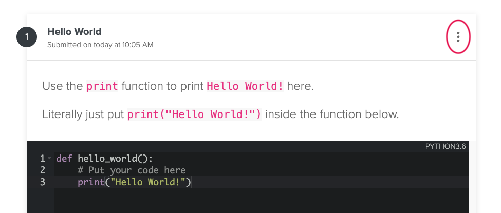
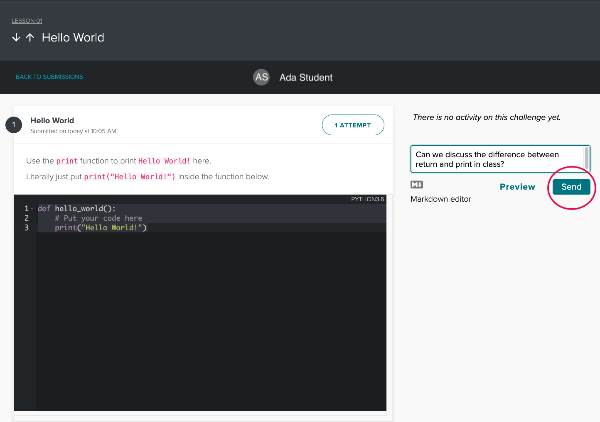

# Getting Started & The Pre-Ada Topics

Welcome to the Ada Precourse! This course, delivered through the "Learn" Learning Management System, is a major tool we will use throughout your education at Ada. The Precourse Unit consists of three Topics: **Getting Ready**, **Practice with Python**, and **Social Justice**. Each topic has a collection of lessons you will need to complete **prior to starting at Ada**.

## Learn Terms

| Term | Definition | Example | Used in a Sentence |
| -- | -- | -- |--|
| Lesson | A combination of written material, video lessons, and code challenges focused on one main concept.  | Getting Started & The Pre-Ada Topics, Installfest - Getting Software Installed  | "Conditionals is the name of a lesson in the Practice with Python topic." |
| Topic | A collection of related lessons. Topics appear as a square on the main Learn course page. | Getting Ready, Practice with Python, Social Justice | "Social Justice is a topic in the Precourse unit" |
| Unit | A collection of related topics | Precourse, About Ada, Unit 1 | "Precourse is the first unit in the C18 Learn Course" |

The purpose of the Precourse Unit is to keep you coding (and talking about code) between admissions and the first day of class. You should understand the topics covered in the Precourse and [Build curriculum](http://ada-developers-academy.github.io/ada-build/) and practice this understanding with the assignments provided. Take this opportunity to meet and study with peers in your cohort.  You will have been invited to the Cohort Slack, and we will set up a channel to discuss the course and coding challenges.  **Take advantage of it.**

All admitted students are expected to be well-versed with the concepts covered [Ada Build curriculum](http://ada-developers-academy.github.io/ada-build/) on the first day of their cohort. This includes conditional flows, loops, functions, lists, dictionaries and Python basics. As such, you are expected to complete all exercises in the Precourse.  

As you complete each assignment you will receive feedback, some of which is automated and others are not.  The Learn platform is generally pretty reliable, but **if you run into any issues submitting assignments or receiving feedback, please let us know in Slack!**

Some exercises here are multiple choice, some ask you to write code into a coding window, while others ask you to submit a link to your solution.  Many of the exercises here have tests to automatically tell you if you solved it or not.  Others require an instructor to review your code.  Be patient and we will try to deliver feedback as promptly as possible.  

<iframe src="https://adaacademy.hosted.panopto.com/Panopto/Pages/Embed.aspx?id=eb492361-e1ed-47f3-845e-acb5001ae8e6&autoplay=false&offerviewer=true&showtitle=true&showbrand=false&start=0&interactivity=all" height="405" width="720" style="border: 1px solid #464646;" allowfullscreen allow="autoplay"></iframe>

<!-- available callout types: info, success, warning, danger, secondary  -->
### !callout-info

## You can resubmit

In this course you can always resubmit work.  If you want a 2nd-round of instructor feedback let us know on Slack as we normally only give feedback once.

### !end-callout

<!-- available callout types: info, success, warning, danger, secondary  -->
### !callout-danger

## Due Dates

# The Precourse should be completed by Monday, September 2nd at 7pm PDT

### !end-callout

## Learning Goals prior to starting at Ada

In this course we want you to learn to do the following:

*  Consistently follow [Python coding practices](https://www.python.org/dev/peps/pep-0008/)
*  Understand and use conditional statements
*  Understand and use functions
*  Understand and use loops
*  Understand and write functions with parameters
*  Understand and use lists along with loops
*  Understand and use dictionaries
*  Understand and use lists and dictionaries together - nested data structures with loops

We also want you to learn a bit of workflow and learn to use [VS Code](https://code.visualstudio.com/) to write your programs.

## Your Pre-Ada Responsibilities

* Complete the Installfest and make sure you have everything installed
* Complete all the lessons in each topic of the Precourse Unit.

## Coding Exercises

### Tested Code Snippets

As you proceed through this course you will be asked to complete a variety of coding challenges.  Put your code into the text areas provided and when you submit the exercise many will be automatically tested and provide you feedback.  Try the exercise below.

<!-- >>>>>>>>>>>>>>>>>>>>>> BEGIN CHALLENGE >>>>>>>>>>>>>>>>>>>>>> -->
<!-- Replace everything in square brackets [] and remove brackets  -->

### !challenge

* type: code-snippet
* language: python3.6
* id: 9ef56303-7e49-46b3-98fc-838ebf9d08e8
* title: Hello World
* points: 1
* topics: python

##### !question

Use the `print` function to print `Hello World!` here.

Literally just put `print("Hello World!")` inside the function below.

##### !end-question

##### !placeholder

```py
def hello_world():
    '''
    INPUT: 2 dimensional numpy array
    OUTPUT: boolean
    Return true
    '''
    # Put your code here

```

##### !end-placeholder

##### !tests

```py
import unittest
import main as p
from io import StringIO
from unittest.mock import patch 

class TestPython1(unittest.TestCase):
    def test_prints_hello_world(self):
        with patch('sys.stdout', new = StringIO()) as fake_out: 
            p.hello_world()
            self.assertEqual("Hello World!", fake_out.getvalue().strip())
```

##### !end-tests

##### !explanation

In this exercise you learned how to run a coding snippet.  This allows you to enter code and have it checked for correctness via some automated tests.  This will become standard practice across the Ada Precourse.  

It is intended to give you additional practice writing Python code and getting used to having it checked in Learn.

##### !end-explanation

### !end-challenge

<!-- ======================= END CHALLENGE ======================= -->

<!-- available callout types: info, success, warning, danger, secondary, star  -->
### !callout-info

## Tests

Learn checks the correctness of code submissions using unit tests. Testing is introduced early in Unit 1 of the Ada Core Curriculum. Reading and writing tests is emphasized throughout the curriculum.<br>

<br>Until testing is formally introduced, you may find it a bit tricky to read the output of failing tests in Learn. Do your best to use the requirements and the test output to debug your code. You may also find it helpful to review the Precourse lesson on [Errors](../intro-to-python/errors.md)<br>

<br>Below are two examples of tests results for incorrect code for the "Hello, World!" code challenge above.<br>

<br>

<details>
<summary>Expand the arrow to review the test results for an indentation error.</summary>
<br>Code:

```Python
def hello_world():
    '''
    INPUT: 2 dimensional numpy array
    OUTPUT: boolean
    Return true
    '''
        print("Hello World!")
```
<br>Test Results:

```bash

E
======================================================================
ERROR: test_methods (unittest.loader._FailedTest)
----------------------------------------------------------------------
ImportError: Failed to import test module: test_methods
Traceback (most recent call last):
  File "/usr/local/lib/python3.6/unittest/loader.py", line 428, in _find_test_path
    module = self._get_module_from_name(name)
  File "/usr/local/lib/python3.6/unittest/loader.py", line 369, in _get_module_from_name
    __import__(name)
  File "/usr/src/app/test_methods.py", line 7, in <module>
    import main as p
  File "/usr/src/app/main.py", line 7
    print("Hello World!")
    ^
IndentationError: unexpected indent


----------------------------------------------------------------------
Ran 1 test in 0.001s

FAILED (errors=1)

```

</details>

<details>
<summary>Expand the arrow to review the test failure for incorrect capitalization.</summary>
<br>Code:

```Python

def hello_world():
    '''
    INPUT: 2 dimensional numpy array
    OUTPUT: boolean
    Return true
    '''

    print("hello world!")

```

<br>Test Results:

```bash

F
======================================================================
FAIL: test_prints_hello_world (test_methods.TestPython1)
----------------------------------------------------------------------
Traceback (most recent call last):
  File "/usr/src/app/test_methods.py", line 15, in test_prints_hello_world
    self.assertEqual("Hello World!", fake_out.getvalue().strip())
AssertionError: 'Hello World!' != 'hello world!'
- Hello World!
? ^     ^
+ hello world!
? ^     ^


----------------------------------------------------------------------
Ran 1 test in 0.001s

FAILED (failures=1)

```

</details>


### !end-callout

### Links to Code

Other programming exercises called Project Challenges will ask you to submit a link to code in [repl.it](https://repl.it).  Later, after you start at Ada we will have you submit work in Learn from [Github](https://github.com).

<!-- >>>>>>>>>>>>>>>>>>>>>> BEGIN CHALLENGE >>>>>>>>>>>>>>>>>>>>>> -->
<!-- Replace everything in square brackets [] and remove brackets  -->

### !challenge

* type: project
* id: 3680ae6f-8fe0-4169-a6c9-6129b9da492e
* title: Example Project Challenge
* points: 1
* topics: example

##### !question

Create a Hello World Application on [Repl.it](https://repl.it), and submit a link to your submission.

##### !end-question

##### !placeholder

Place your link here

##### !end-placeholder

##### !hint 

You can learn [how to create a gist](https://docs.github.com/en/github/writing-on-github/creating-gists), or just create a program on [repl.it](https://repl.it).

##### !end-hint

### !end-challenge

<!-- ======================= END CHALLENGE ======================= -->

## Learn Comments

After you submit a Learn challenge, you can leave comments or questions for your instructors. To do so, click on the three vertical dots in the right hand corner of the Learn challenge, and then click view details.

  
*Fig. After submitting an answer, these three dots appear. Clicking them shows a popup menu with the option to View Details.*

In the details view, on the right hand side, enter your comment or question and click send.

  
*Fig. The Detail View, where you can review your submission history for the challenge, leave comments, and receive feedback.*

Keep an eye on the alert bell at the top to the left of your username to see follow-up and feedback from instructors.

  
*Fig. The alert bell will show a notification when you receive feedback. Be sure to clear the notifications after reviewing them so that it's easier to notice when a new one arrives.*

## This Topic

This topic includes lessons about workflow, Python style and basic types and operations.  This should feel like review and give you a smooth start.  Try to work through things a bit at a time and feel free to walk away for a bit when you are stuck, or shout out for support on Slack.  

We'll let you get started...
